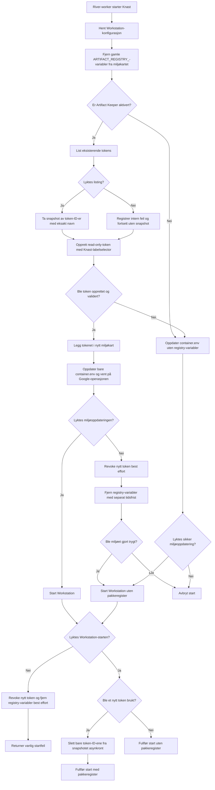

# Artifact Keeper for Knast

## Status

Vi har implementert støtte for å gi hver Knast et eget, kortlevd token med lesetilgang til repositories som er merket for Knast i Artifact Keeper.

Integrasjonen er deaktivert i lokal-, dev- og prod-konfigurasjonen frem til vi kjenner riktige API-adresser og outbound-regler. Ingen produksjonshemmeligheter er lagt i repoet.

## Valgt løsning

- Datamarkedsplassens backend utsteder tokenet ved hver Knast-start.
- Tokenet får navnet `knast:<workstation-id>`.
- `workstation-id` valideres med `^[a-z][a-z0-9-]*$`, slik at vanlige Nav-identer som `p123456` er tillatt.
- Tokenet varer i ett døgn og har bare scopet `read:artifacts`.
- Tokenet gir lesetilgang til alle repositories med labelen `<konfigurert nøkkel>=true`.
- Artifact Keeper evaluerer labelselectoren dynamisk. En labelendring kan derfor endre tilgangen for aktive tokens.
- Backend bruker et eget Artifact Keeper-tjenestetoken fra miljøvariabelen `ARTIFACT_KEEPER_SERVICE_TOKEN`.
- Tjenestetokenet sendes aldri til Workstation eller frontend.
- Knast-tokenet lagres ikke i backend-databasen eller River-jobben.

Token-requesten er:

```json
{
  "name": "knast:<workstation-id>",
  "expires_in_days": 1,
  "scopes": ["read:artifacts"],
  "repo_selector": {
    "match_labels": {
      "knast-default": "true"
    }
  }
}
```

## Miljøvariabler i Knast

Backend erstatter hele `container.env` gjennom en smal Google Workstations-oppdatering som bare har `container.env` i update-masken. Alle gamle variabler med prefikset `ARTIFACT_REGISTRY_` fjernes først.

Ved vellykket tokenopprettelse legges bare tokenet til:

```text
ARTIFACT_REGISTRY_TOKEN=<kortlevd-token>
```

Knast-imaget eier repository-URL-er, brukernavnet `__token__` og oppsettet for uv, pip, R og andre pakkeverktøy. Tokenet legges aldri i en URL.

## Oppstarts- og feilflyt

Oppstarten følger denne rekkefølgen:

1. Hent eksisterende Workstation-konfigurasjon.
2. Fjern gamle `ARTIFACT_REGISTRY_*`-variabler fra miljøkartet.
3. List eksisterende tokens og ta et snapshot av ID-ene med eksakt samme tokennavn.
4. Opprett et nytt token.
5. Oppdater `container.env` og vent på at Google-operasjonen blir ferdig.
6. Start Workstation.
7. Slett bare token-ID-ene fra snapshotet, asynkront og best effort.



Listingfeil blokkerer ikke utstedelse av et nytt token. Oppryddingen gjør ingen ny listing, slik at en forsinket jobb ikke kan slette tokenet fra en nyere start.

Artifact Keeper-feil gir normalt start uten pakkeregister. Backend fjerner da gamle registry-variabler før Workstation startes. Hvis backend ikke kan gjøre Workstation-konfigurasjonen trygg, avbrytes starten.

Hvis tokenet er opprettet, men miljøoppdateringen eller Workstation-starten feiler, prøver backend å:

- revoke det nye tokenet
- fjerne registry-variablene med en separat tidsfrist

Ved pod-restart kan asynkron opprydding gå tapt. Ett døgns utløpstid er sikkerhetsnettet.

## Artifact Keeper-klient

Den nye klienten ligger i `pkg/artifactkeeper/` og støtter:

- listing med paginering
- opprettelse av token
- sletting av token via token-ID
- Bearer-auth uten cookie
- ett retry ved transportfeil og HTTP 5xx
- ingen retry ved HTTP 4xx
- context-aware backoff med jitter
- responsgrense på 1 MiB
- feil uten rå request- eller response-body

POST kan bli utført på nytt etter et transportavbrudd hvor serverens resultat er ukjent. Det kan gi et foreldreløst token. Dette er akseptert fordi tokenet er read-only, utløper etter ett døgn og ryddes ved en senere start når det blir synlig i listing.

## Konfigurasjon

Ny seksjon:

```yaml
artifact_keeper:
  enabled: false
  api_url: ""
  timeout_seconds: 5
  total_timeout_seconds: 10
  knast_repository_selector:
    access_label: knast-default
```

Når `enabled` er `true`, feiler backend ved oppstart hvis obligatorisk konfigurasjon mangler eller er ugyldig. `access_label` er labelnøkkelen, og backend bygger selectoren `<access_label>=true`. Nøkkelen kan inneholde små bokstaver, tall, punktum, understrek og bindestrek. Wildcard og path-tegn er ikke tillatt.

Bare Artifact Keeper-administratorer skal kunne endre tilgangslabelene. Når selectoren evalueres dynamisk, får aktive tokens straks tilgang til et repository som merkes med riktig label. De mister tilsvarende tilgangen når labelen fjernes.

Standardnøkkelen er `knast-default`. Artifact Keeper krever at et repository har alle key-value-parene i `match_labels`. Flere labels i samme selector har derfor AND-semantikk, ikke OR-semantikk.

Dagens implementasjon utsteder ett token med bare `knast-default=true`. Senere tilgangsgrupper som `knast-r=true` og `knast-go=true` må få hvert sitt token. De skal ikke legges til i samme selector for å uttrykke union, siden det bare ville matchet repositories med alle labelene. Et repository kan merkes med flere labels dersom det skal være tilgjengelig gjennom flere separate tokens.

Tjenestetokenet leses separat:

```text
ARTIFACT_KEEPER_SERVICE_TOKEN
```

Det skal ligge i en Nais Secret, ikke i ConfigMap eller YAML-fil.

## Observerbarhet

Integrasjonen eksponerer metrikker uten token, workstation-ID eller fritekstfeil som labels:

```text
nada_backend_artifact_keeper_requests_total
nada_backend_artifact_keeper_request_duration_seconds
nada_backend_artifact_keeper_retries_total
nada_backend_workstation_artifact_registry_outcomes_total
```

Create-respons, Authorization-header og Workstation-token logges ikke. Klientfeil inkluderer heller ikke rå response-body.

## Tester og verifisering

Vi har lagt til tester for:

- Bearer-auth uten cookie
- eksakt create-request
- listing og sletting
- ett retry ved 5xx
- ingen retry ved 4xx
- redigering av markørtoken fra feilrespons
- snapshot av gamle token-ID-er med eksakt tokennavn
- avvisning av ugyldig eller tom create-respons
- sletting av token-ID fra en ugyldig create-respons
- injisering av bare `ARTIFACT_REGISTRY_TOKEN` og fjerning av gamle registry-miljøvariabler
- erstatning av hele miljøkartet uten å endre image eller maskintype

Utførte kontroller:

- 25 målrettede tester bestod.
- `go vet` bestod for Artifact Keeper- og Workstations-pakkene.
- `gofmt` er kjørt.
- `git diff --check` bestod.

Full `go test ./...` og direkte tester av `pkg/service/core` ble blokkert av manglende lokal tilgang til `riverqueue.com/riverpro@v0.26.1`.

Trivy fant ingen nye hardkodede Artifact Keeper-hemmeligheter. Skanningen rapporterte eksisterende funn i lokal `.env`, testnøkler, eksisterende ConfigMap-felter og Dockerfiles. Disse ble ikke opprettet som del av denne endringen.

## Lokal testing

Kjør målrettede tester:

```bash
go test ./pkg/artifactkeeper ./pkg/workstations \
  ./pkg/service/core/api/gcp \
  ./pkg/service/core/api/http \
  ./pkg/config/v2 \
  -run 'TestArtifact|TestClient|TestWorkstation|TestLoad'
```

For en manuell test mot en Artifact Keeper-testinstans:

1. Kopier `config-local.yaml` til en fil utenfor repoet.
2. Sett `enabled: true`, `api_url` og `knast_repository_selector.access_label` i kopien.
3. Eksporter et dedikert testtoken som `ARTIFACT_KEEPER_SERVICE_TOKEN`.
4. Start lokale avhengigheter med `make start-run-deps setup-metabase`.
5. Start backend med `go run ./cmd/nada-backend --config <konfigurasjonsfil>` og de samme Google-emulatorvariablene som brukes av `make run`.
6. Start en Knast og kontroller token-request, Workstation-miljø og metrikker.

Testtokenet skal ikke skrives i repository, URL, logger eller shell history.

## Før aktivering

Følgende mangler før integrasjonen kan aktiveres i dev eller prod:

1. Bekreft Artifact Keeper API-URL og Knast-labelverdi per miljø.
2. Opprett en dedikert Artifact Keeper-identitet med minste tilgjengelige rolle.
3. Legg `ARTIFACT_KEEPER_SERVICE_TOKEN` i riktig Nais Secret.
4. Legg inn eksplisitt outbound-policy når applikasjonsnavn, namespace eller host er kjent.
5. Kjør kontrakttest mot den faktiske Artifact Keeper-instansen.
6. Verifiser at tokenet kan lese alle repositories med riktig label, men ikke publisere eller lese repositories uten labelen.
7. Verifiser dynamisk tilgang ved å legge til og fjerne labelen mens tokenet er aktivt.
8. Verifiser revoke og at ingen tokenverdier finnes i logger eller traces.
9. Aktiver først i dev og følg metrikker før prod.

Rollback er å sette `artifact_keeper.enabled` til `false`. Ved neste Knast-start fjerner backend gamle `ARTIFACT_REGISTRY_*`-variabler før Workstation startes.

## Filer

De viktigste nye og endrede områdene er:

- `pkg/artifactkeeper/`
- `pkg/service/artifactkeeper.go`
- `pkg/service/core/api/http/http_artifactkeeper.go`
- `pkg/service/core/service_artifact_registry_credentials.go`
- `pkg/service/core/service_workstations.go`
- `pkg/workstations/workstations.go`
- `pkg/config/v2/config.go`
- `cmd/nada-backend/main.go`
- lokale konfigurasjonsfiler og dev/prod ConfigMaps

De eksisterende brukerfilene `cluster.tf` og `k.txt` ble ikke endret som del av arbeidet.
